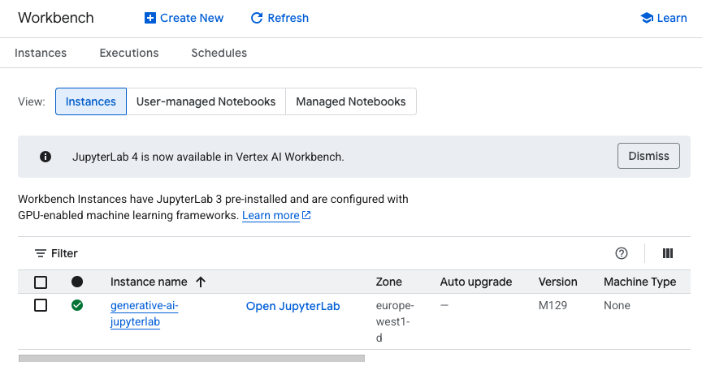

# GCP-LAB-Introduction-to-Function-Calling-with-Gemini
Introduction to Function Calling with Gemini

Overview
Function calling lets developers create a description of a function in their code, then pass that description to a language model in a request. The response from the model includes the name of a function that matches the description and the arguments to call it with.

Function calling is similar to Vertex AI Extensions in that they both generate information about functions. The difference between them is that function calling returns JSON data with the name of a function and the arguments to use in your code, whereas Vertex AI Extensions returns the function and calls it for you.

Gemini
Gemini is a family of powerful generative AI models developed by Google DeepMind, capable of understanding and generating various forms of content, including text, code, images, audio, and video.

Gemini API in Vertex AI
The Gemini API in Vertex AI provides a unified interface for interacting with Gemini models. This allows developers to easily integrate these powerful AI capabilities into their applications. For the most up-to-date details and specific features of the latest versions, please refer to the official Gemini documentation.

Gemini Models
Gemini Pro: Designed for complex reasoning, including:
Analyzing and summarizing large amounts of information.
Sophisticated cross-modal reasoning (across text, code, images, etc.).
Effective problem-solving with complex codebases.
Gemini Flash: Optimized for speed and efficiency, offering:
Sub-second response times and high throughput.
High quality at a lower cost for a wide range of tasks.
Enhanced multimodal capabilities, including improved spatial understanding, new output modalities (text, audio, images), and native tool use (Google Search, code execution, and third-party functions).
Prerequisites
Before starting this lab, you should be familiar with:

Basic Python programming.
General API concepts.
Running Python code in a Jupyter notebook on Vertex AI Workbench.
Objectives
In this lab, you learn how to:

Install the Vertex AI SDK for Python.
Use the Gemini API in Vertex AI to interact with the Gemini 2.0 Flash (gemini-2.0-flash) model:
Generate function calls from a text prompt to help customers get information about products in the Google Store.
Generate function calls from a text prompt and call an external API to geocode addresses.
Generate function calls from a text prompt to extract entities from log data.


Task 1. Open the notebook in Vertex AI Workbench
In the Google Cloud console, on the Navigation menu (Navigation menu icon), click Vertex AI > Workbench.

Find the generative-ai-jupyterlab instance and click on the Open JupyterLab button.

The JupyterLab interface for your Workbench instance opens in a new browser tab.




### Task 2. Set up the notebook
Open the intro_function_calling file.

In the Select Kernel dialog, choose Python 3 from the list of available kernels.

Run through the Getting Started and the Import libraries sections of the notebook.

For Project ID, use qwiklabs-gcp-03-396a6219f49e, and for Location, use europe-west1.
Note: You can skip any notebook cells that are noted Colab only. If you experience a 429 response from any of the notebook cell executions, wait 1 minute before running the cell again to proceed.
In the following sections, you will run through the notebook cells to see how to use the Gemini API in Vertex AI with the Vertex AI SDK for Python.


### Task 3. Using function calling for structured Google Store queries
When working with a generative text model, it can be difficult to coerce the LLM to give consistent responses in a structured format such as JSON. Function calling makes it easy to work with LLMs via prompts and unstructured inputs, and have the LLM return a structured response that can be used to call an external function.

You can think of function calling as a way to get structured output from user prompts and function definitions, use that structured output to make an API request to an external system, then return the function response to the LLM to generate a response to the user. In other words, function calling in Gemini extracts structured parameters from unstructured text or messages from users. In this example, you'll use function calling along with the chat modality in the Gemini model to help customers get information about products in the Google Store.

In this task, run through the notebook cells to see how to use the Gemini model to help customers get information about products in the Google Store.


##### Chat example: Using Function Calling in a chat session to answer user's questions about the Google Store
In this example, you'll use Function Calling along with the chat modality in the Gemini model to help customers get information about products in the Google Store.

You'll start by defining three functions: one to get product information, another to get the location of the closest stores, and one more to place an order:


```
get_product_info = FunctionDeclaration(
    name="get_product_info",
    description="Get the stock amount and identifier for a given product",
    parameters={
        "type": "OBJECT",
        "properties": {
            "product_name": {"type": "STRING", "description": "Product name"}
        },
    },
)

get_store_location = FunctionDeclaration(
    name="get_store_location",
    description="Get the location of the closest store",
    parameters={
        "type": "OBJECT",
        "properties": {"location": {"type": "STRING", "description": "Location"}},
    },
)

place_order = FunctionDeclaration(
    name="place_order",
    description="Place an order",
    parameters={
        "type": "OBJECT",
        "properties": {
            "product": {"type": "STRING", "description": "Product name"},
            "address": {"type": "STRING", "description": "Shipping address"},
        },
    },
)

```

Note that function parameters are specified as a Python dictionary in accordance with the OpenAPI JSON schema format.

Define a tool that allows the Gemini model to select from the set of 3 functions:


```
retail_tool = Tool(
    function_declarations=[
        get_product_info,
        get_store_location,
        place_order,
    ],
)
```

Now you can initialize the Gemini model with Function Calling in a multi-turn chat session.

You can specify the tools kwarg when initializing the chat session to avoid having to send it with every subsequent request:

```
chat = client.chats.create(
    model=MODEL_ID,
    config=GenerateContentConfig(
        temperature=0,
        tools=[retail_tool],
    ),
)
```

Note: The temperature parameter controls the degree of randomness in this generation. Lower temperatures are good for functions that require deterministic parameter values, while higher temperatures are good for functions with parameters that accept more diverse or creative parameter values. A temperature of 0 is deterministic. In this case, responses for a given prompt are mostly deterministic, but a small amount of variation is still possible.

We're ready to chat! Let's start the conversation by asking if a certain product is in stock:

```
prompt = """
Do you have the Pixel 9 in stock?
"""

response = chat.send_message(prompt)
response.function_calls[0]
```

>FunctionCall(id=None, args={'product_name': 'Pixel 9'}, name='get_product_info')

### Task 4. Using function calling to geocode addresses with a maps API
In this example, you'll use the text modality in the Gemini API to define a function that takes multiple parameters as inputs. You'll use the function call response to then make a live API call to convert an address to latitude and longitude coordinates.

In this task, run through the notebook cells to see how to use the Gemini Pro model to generate a function call to geocode an address.
Here we used the OpenStreetMap Nominatim API to geocode an address to make it easy to use and learn in this notebook. If you're working with large amounts of maps or geolocation data, you can use the Google Maps Geocoding API.
Click Check my progress to verify the objective.


The response from the Gemini API consists of a structured data object that contains the name and parameters of the function that Gemini selected out of the available functions.

Since this notebook focuses on the ability to extract function parameters and generate function calls, you'll use mock data to feed synthetic responses back to the Gemini model rather than sending a request to an API server (not to worry, we'll make an actual API call in a later example!):

```
# Here you can use your preferred method to make an API request and get a response.
# In this example, we'll use synthetic data to simulate a payload from an external API response.

api_response = {"sku": "GA04834-US", "in_stock": "yes"}
```

In reality, you would execute function calls against an external system or database using your desired client library or REST API.

Now, you can pass the response from the (mock) API request and generate a response for the end user:


```
response = chat.send_message(
    Part.from_function_response(
        name="get_product_info",
        response={
            "content": api_response,
        },
    ),
)
display(Markdown(response.text))
```

>Yes, we have the Pixel 9 in stock


Next, the user might ask where they can buy a different phone from a nearby store:

```
prompt = """
What about the Pixel 9 Pro XL? Is there a store in
Mountain View, CA that I can visit to try one out?
"""

response = chat.send_message(prompt)
response.function_calls
```

>[FunctionCall(id=None, args={'product_name': 'Pixel 9 Pro XL'}, name='get_product_info'),
 FunctionCall(id=None, args={'location': 'Mountain View, CA'}, name='get_store_location')]

 Again, you get a response with structured data, but notice that there are two function calls instead of one!

The Gemini model identified that it needs both the get_product_info and get_store_location functions. Look closely at the prompt that you used in this conversation turn a few cells up, and you'll notice that the user asked about a product -and- the location of a store.

In cases like this when two or more functions are defined (or when the model predicts multiple function calls to the same function), the Gemini model might sometimes return back-to-back or parallel function call responses within a single conversation turn.

This is expected behavior since the Gemini model predicts which functions it should call at runtime, what order it should call dependent functions in, and which function calls can be parallelized, so that the model can gather enough information to generate a natural language response.

Not to worry! You can repeat the same steps as before and build synthetic payloads that would come from an external APIs:


```
# Here you can use your preferred method to make an API request and get a response.
# In this example, we'll use synthetic data to simulate a payload from an external API response.

product_info_api_response = {"sku": "GA08475-US", "in_stock": "yes"}
store_location_api_response = {
    "store": "2000 N Shoreline Blvd, Mountain View, CA 94043, US"
}
```

Again, you can pass the responses from the (mock) API requests back to the Gemini model:

```
response = chat.send_message(
    [
        Part.from_function_response(
            name="get_product_info",
            response={
                "content": product_info_api_response,
            },
        ),
        Part.from_function_response(
            name="get_store_location",
            response={
                "content": store_location_api_response,
            },
        ),
    ]
)
display(Markdown(response.text))
```

>Yes, the Pixel 9 Pro XL is in stock. The store located at 2000 N Shoreline Blvd, Mountain View, CA 94043, US is the closest store to you.

Nice work!

Within a single conversation turn, the Gemini model requested 2 function calls in a row before returning a natural language summary. In reality, you might follow this pattern if you need to make an API call to an inventory management system, and another call to a store location database, customer management system, or document repository.

Finally, the user might ask to order a phone and have it shipped to their address:

```
prompt = """
I'd like to order a Pixel 9 Pro XL and have it shipped to 1155 Borregas Ave, Sunnyvale, CA 94089.
"""

response = chat.send_message(prompt)
response.function_calls
```

>[FunctionCall(id=None, args={'product': 'Pixel 9 Pro XL', 'address': '1155 Borregas Ave, Sunnyvale, CA 94089'}, name='place_order')]


Perfect! The Gemini model extracted the user's selected product and their address. Now you can call an API to place the order:

```
# This is where you would make an API request to return the status of their order.
# Use synthetic data to simulate a response payload from an external API.

order_api_response = {
    "payment_status": "paid",
    "order_number": 12345,
    "est_arrival": "2 days",
}

```

And send the payload from the external API call so that the Gemini API returns a natural language summary to the end user.

```
response = chat.send_message(
    Part.from_function_response(
        name="place_order",
        response={
            "content": order_api_response,
        },
    ),
)
display(Markdown(response.text))
```

>OK. I've placed an order for a Pixel 9 Pro XL to be shipped to 1155 Borregas Ave, Sunnyvale, CA 94089. The order number is 12345, and it should arrive in 2 days. The payment status is paid.


And you're done!

You were able to have a multi-turn conversation with the Gemini model using function calls, handling payloads, and generating natural language summaries that incorporated the information from the external systems.


### Task 5. Using function calling for entity extraction
In the previous examples, you made use of the entity extraction functionality within Gemini Function Calling so that you could pass the resulting parameters to a REST API or client library. However, you might want to only perform the entity extraction step with Gemini Function Calling and stop there without actually calling an API. You can think of this functionality as a convenient way to transform unstructured text data into structured fields.

In this example, you'll build a log extractor that takes raw log data and transforms it into structured data with details about error messages.

In this task, run through the notebook cells to see how to use the Gemini Pro model to generate function calls to extract entities from log data.

##### Address example: Using Automatic Function Calling to geocode addresses with a maps API
In this example, you'll define a function that takes multiple parameters as inputs. Then you'll use automatic function calling in the Gemini API to make a live API call to convert an address to latitude and longitude coordinates.

Start by writing a Python function:

```
def get_location(
    amenity: str | None = None,
    street: str | None = None,
    city: str | None = None,
    county: str | None = None,
    state: str | None = None,
    country: str | None = None,
    postalcode: str | None = None,
) -> list[dict]:
    """
    Get latitude and longitude for a given location.

    Args:
        amenity (str | None): Amenity or Point of interest.
        street (str | None): Street name.
        city (str | None): City name.
        county (str | None): County name.
        state (str | None): State name.
        country (str | None): Country name.
        postalcode (str | None): Postal code.

    Returns:
        list[dict]: A list of dictionaries with the latitude and longitude of the given location.
                    Returns an empty list if the location cannot be determined.
    """
    base_url = "https://nominatim.openstreetmap.org/search"
    params = {
        "amenity": amenity,
        "street": street,
        "city": city,
        "county": county,
        "state": state,
        "country": country,
        "postalcode": postalcode,
        "format": "json",
    }
    # Filter out None values from parameters
    params = {k: v for k, v in params.items() if v is not None}

    try:
        response = requests.get(base_url, params=params, headers={"User-Agent": "none"})
        response.raise_for_status()
        return response.json()
    except requests.RequestException as e:
        print(f"Error fetching location data: {e}")
        return []
```

In this example, you're asking the Gemini model to extract components of the address into specific fields within a structured data object. These fields are then passed to the function you defined and the result is returned to Gemini to make a natural language response.

Send a prompt that includes an address, such as:


```
prompt = """
I want to get the coordinates for the following address:
1600 Amphitheatre Pkwy, Mountain View, CA 94043
"""

response = client.models.generate_content(
    model=MODEL_ID,
    contents=prompt,
    config=GenerateContentConfig(tools=[get_location], temperature=0),
)
print(response.text)
```

Great work! You were able to define a function that the Gemini model used to extract the relevant parameters from the prompt. Then you made a live API call to obtain the coordinates of the specified location.

Here we used the OpenStreetMap Nominatim API to geocode an address to keep the number of steps in this tutorial to a reasonable number. If you're working with large amounts of address or geolocation data, you can also use the Google Maps Geocoding API, or any mapping service with an API!

##### Conclusions
You have explored the function calling feature through the Google Gen AI Python SDK.

The next step is to enhance your skills by exploring this documentation page.


